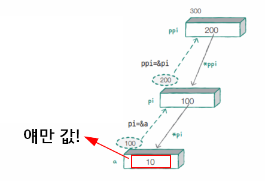

# iot-basic-programming
IoT개발자과정 기초 프로그래밍 언어 학습 리포지토리

데이터 출력방법 : [확인](./Day01/Chap02-Solution/Chap02-02-app/main.c)

### C기본문법

-진법 산용방법 : 아래 확인

    - 2진수 -> 컴퓨터의 데이터가 모두 0,1 로 저장되어 있음
    - 8진수 -> 비트로 데이터를 처리할 때 비트 단위가 8이므로
    - 16진수 -> 255까지의 수를 짧게 표현하고자 사용
    - 10진수 -> 사람이 쓰는 진법

- 진수별 사용방법 : [확인](./Day01/Chap02-Solution/Chap02-03-app/main.c)

    |10진수|0|1|2|3|4|5|6|7|8|9|10|
    |:---:|:---:|:---:|:---:|:---:|:---:|:---:|:---:|:---:|:---:|:---:|:---:|
    |16진수|0x0|0x1|0x2|0x3|0x4|0x5|0x6|0x7|0x8|0x9|0xA|
    |8진수|0|1|2|3|4|5|6|7|10|11|12|

## 2일차
### C기본 문법 계속

1. 기본문법

    - 데이터형 : [확인](./Day02/Chap03-Solution/Chap03-01-app/main.c)
    - 실수형 및 변수 : [확인](./Day02/Chap03-Solution/Chap03-02-app/main.c)
    - 데이터 입력 : [확인](./Day02/Chap03-Solution/Chap03-03-app/main.c)

    - 연산자 : [확인](./Day02/Chap04-Solution/Chap04-01-app/main.c)
        - 퀴즈(bmi) : [확인](./Day02/Chap04-Solution/Chap04-Quiz-4/Chap04-Quiz-4.cpp)

## 3일차

1. 제어문
    - if문 : [확인](./Day03/Chap05-Solution/Chap05-01-app/main.c)
    - switch-case문 : [확인](./Day03/Chap05-Solution/Chap05-02-app/main.c)

2. 반복문 
    - while : [확인](./Day03/Chap05-Solution/Chap05-03-app/main.c)
    - for : [확인](./Day03/Chap05-Solution/Chap05-04-app/main.c)
    - 구구단 : [확인](./Day03/Chap05-Solution/Chap05-05-app/main.c)
    - 무한루프 :[확인](./Day03/Chap05-Solution/Chap05-06-app/)
    - 컨티뉴, 브레이크 :[확인](./Day03/Chap05-Solution/Chap05-07-app/main.c)

3. 디버깅
    - 단축키[확인](./Day03/Chap05-Solution/)
        - F5 : 디버깅 시작
        - shift + f5 : 디버깅 종료
        - F9 : 브레이크 포인트
        - F10 : 소스코드 한 줄 실행   
        - F11 : 소스코드 내 함수나 클래스가 존재하면 내부로 진입   
        - 로컬, 조사식 창 활용

4. 함수
    - 함수 기본 : [확인](./Day03/Chap07-Solution/Chap07-01-app/main.c)

## 5일차
### C기본문법

1. 포인터
    - 포인터이해 
        - 변수의 주소를 담고, 간접참조연산자(*)로 그 변수의 값을 사용하기 위한 것
        - 변수의 주소를 변경해서 "여러 변수를 사용가능"
        - 변수의 주소는 바뀌지 않는 값임

    - 포인터 크기

    - 포인터 사용 이유
        - 용량이 제한된 [임베디드 시스템](https://ko.wikipedia.org/wiki/%EC%9E%84%EB%B2%A0%EB%94%94%EB%93%9C_%EC%8B%9C%EC%8A%A4%ED%85%9C)에서 데이터를 공유하기 위해서
        - 주소를 공유해서 함수 어디서나 변수의 값을 변경할 수 있음

2. 배열과 포인터[확인](./Day05/Chap10-Solution/Chap10-02-app/main.c)
    - scanf 배열 str[80]선언 후 &str 사용
    - 실무에서 데이터를 공유하면 보통 배열도 많이 사용됨
    - 배열을 그래도 매개변수로 전달하면 메모리를 많이 사용하게 됨
    - int ary[100] -> main에서 400바이트, 함수에서 400바이트 메모리 공간 확보함(총 800)
    - 근데 포인터를 쓰면 거의 절반(400에서 8바이트만큼만 더 사용)만 사용함
    - 배열의 주소를 함수에 전달함[확인](./Day05/Chap10-Solution/Chap10-03-app/main.c)

3. 문자
    - getchar() 입력 버퍼 한글자 지우기[확인](./Day05/Chap11-Solution/Chap11-02-app/main.c)

4. 문자열 기본 : [소스](./Day05/Chap12-Solution/Chap12-01-app/main.c)
    - 문자열 상수와 문자포인터 변수 사용법

## 6일차
### C 중급 문법

4. 문자열과 포인터 : [소스](./Day06/Chap13-Solution/Chap13-01-app/main.c)
    - 문자열 연산 함수 - 자주 사용하는 문자열 처리 내장함수
    - strlen, strcpy, strncpy, strcat, strncat, strcmp, strncmp

5. Tip
    - #pragma region, #pragma endregion 소스코드 영역에서 일부 축소

6. 변수 영역과 데이터 공유 : [소스](./Day06/Chap13-Solution/Chap13-02/main.c)
    - auto : 지역변수 
    - global : 전역 변수
    - static : 불변 : [소스](./Day06/Chap13-Solution/Chap13-03-app/main.c)
    - register : cpu의 레지스터 메모리에 변수 저장

7. 데이터 공유 방법
    - 데이터를 필요할떄마다 복사하는 것보다, 같이 공유하는 것이 메모리를 절약하는 방법임
    - 값을 복사해서 전달
    - 주소를 전달
    - 포인터 변수를 전달

8. 다차원 배열 : [소스](./Day06/Chap14-Solution/Chap14-01-app/main.c)
    - 1차원 배열 : score[5] 
    - 2차원 배열 : score[5] * 3  => score[3][4] 3행(row) 4열(colum)

9. 포인터 배열
    - 2차원 배열과 유사 : [소스](./Day06/Chap14-Solution/Chap14-02-app/main.c)

10. 이중포인터
    - 값은 a =10 밖에 없음 나머지는 모두 주소
    
    - [단일 포인터 배열](./Day05/Chap10-Solution/Chap10-03-app/main.c/) vs [이중 포인터 배열](./Day06/Chap15-Solution/Chap15-02-app/main.c)

11. 함수와 void포인터
    - 

