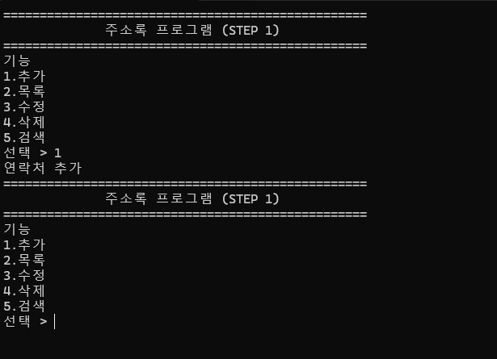
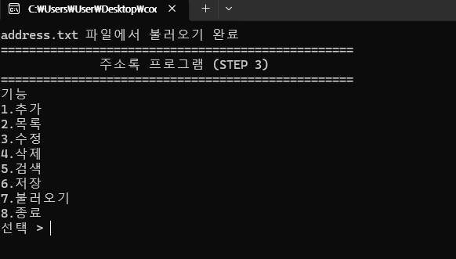
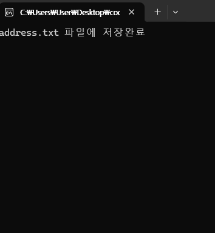
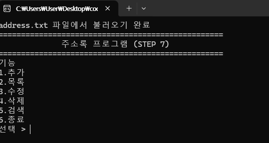
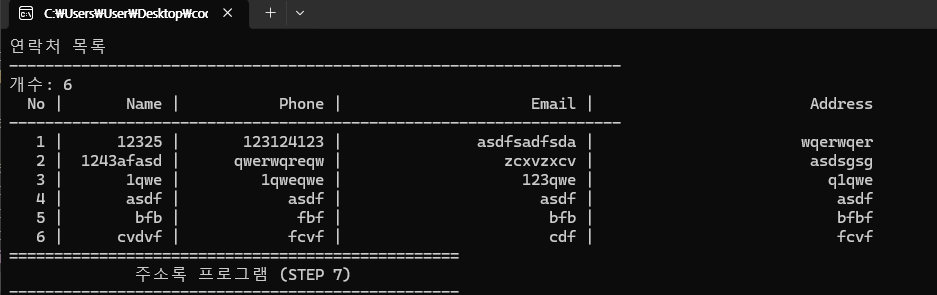
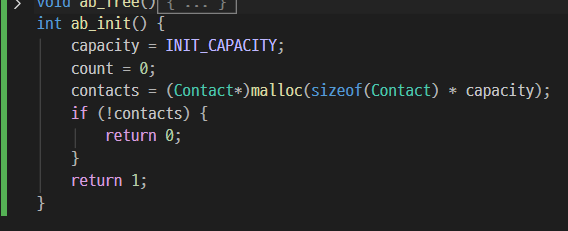

## 토이프로젝트

### 주소록 프로그램

#### 개요

- C 기본 학습 후 (구조체 , 배열, 포인터, 파일IO, 문자열, 검색, 정렬 . . .) 활용하는 묶음 프로젝트

#### 목표(ADT 근간)

- 연락처 추가/목록/수정/삭제/검색

- 파일저장/불러오기
- (추가)정렬/중복체크/csv 등으로 내보내기

#### 데이터 모델
- 이름, 전화, 이메일, 주소, 메모
- 구조체로 생성

### 스텝 1
- 콘솔 메뉴와 기본 뼈대만 동작

### 스텝 2
- 구조체, 배열, 추가/목료, 종료 구현

### 스텝3
- 이름으로 검색
- 이름 부분일치(김 -> 김철수 전부 검색)
- 결과 없으면 메세지
- 삭제 기능 구현 완료

### 스텝4
- 파일 입출력까지 모두 구현 완료 [소스](./Day10/ToyProject01/addressbookapp4.c/addressbookapp4.c)

### 스텝5
- 따로 저장 로드가 아닌 실행시 로드, 종료시 저장

### 스텝6
- 주소 저장시 정렬하여 저장

### 스텝7
- 동적배열 활용하여 100개 이상 저장

### 스텝8
- 단일 파일이 아닌 여러 파일로 분리하여 컴파일
